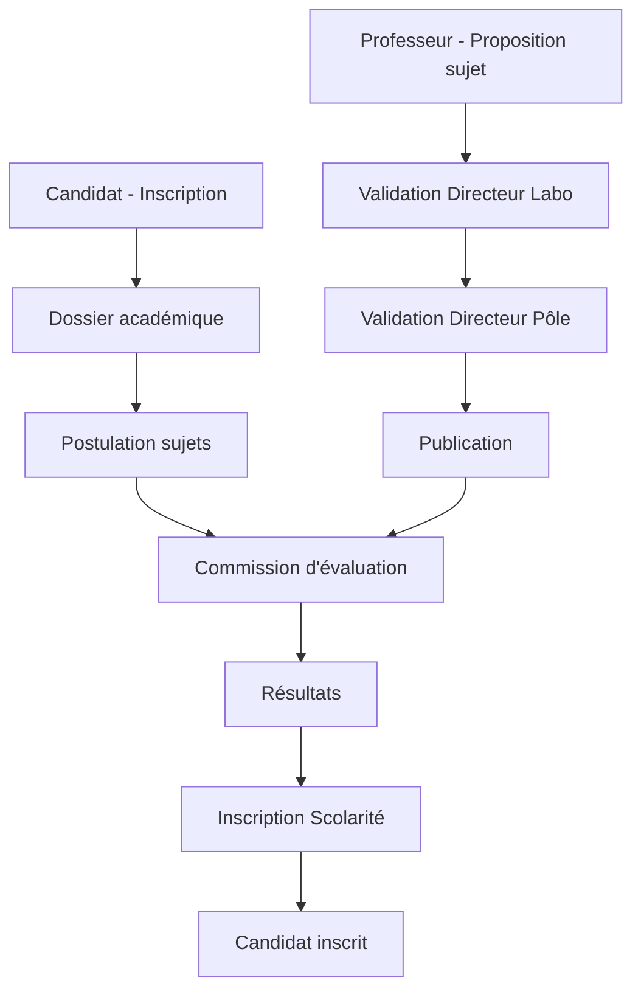

Voici votre fichier `README.md` structuré et complet :

```markdown
# eDoctorat - Plateforme de Gestion des Doctorats

**eDoctorat** est une application web fullstack conçue pour dématérialiser et gérer l'ensemble du processus doctoral, de la candidature initiale jusqu'à l'inscription finale, en passant par la proposition de sujets et les commissions d'évaluation.

## 📋 Table des matières
- [Fonctionnalités principales](#-fonctionnalités-principales)
- [Architecture technique](#-architecture-technique)
- [Rôles et permissions](#-rôles-et-permissions)
- [Installation et déploiement](#-installation-et-déploiement)
- [Configuration](#-configuration)
- [Workflow du système](#-workflow-du-système)
- [Contributeurs](#-contributeurs)
- [Licence](#-licence)

## 🎯 Fonctionnalités principales

### Processus complet de gestion
- **Candidature en ligne** avec dépôt numérique de documents
- **Proposition et validation hiérarchique des sujets** de thèse
- **Évaluation des candidats** par commissions spécialisées
- **Inscription administrative** avec vérification par la scolarité
- **Calendrier académique** configurable par période

### Modules spécifiques
- **Gestion des diplômes** et annexes académiques
- **Système de notifications** par email
- **Reporting et PV de délibération**
- **Import/Export CSV** pour les données massives
- **Tableaux de bord** par rôle et par laboratoire

## 🏗️ Architecture technique

### Backend (Spring Boot 3)
```
📁 backend/
├── 📁 config/          # Configuration Spring
├── 📁 controllers/     # Points d'entrée API REST
├── 📁 facade/         # Pattern Facade d'abstraction
├── 📁 services/       # Logique métier par module
├── 📁 repositories/   # Accès aux données JPA
├── 📁 security/       # JWT, OAuth2, RBAC
├── 📁 models/         # Entités JPA
└── 📁 utils/          # Classes utilitaires
```

**Technologies clés :**
- Spring Boot 3, Spring Security, Spring Data JPA
- JWT Authentication + OAuth2 Google Login
- MySQL/PostgreSQL avec relations complexes
- Design Pattern **Facade** pour abstraction des services
- Java Mail Sender pour les notifications
- Validation des données avec Hibernate Validator

### Frontend (React)
```
📁 frontend/
├── 📁 public/
├── 📁 src/
│   ├── 📁 api/         # Configuration Axios
│   ├── 📁 components/  # Composants réutilisables
│   ├── 📁 hooks/       # Custom Hooks (React Query)
│   ├── 📁 pages/       # Pages par rôle
│   ├── 📁 context/     # Context API (Auth, UI)
│   ├── 📁 utils/       # Fonctions utilitaires
│   └── 📁 assets/      # Images, styles
```

**Technologies clés :**
- React 18 avec fonctionnalités modernes
- React Query (TanStack Query) pour le state management
- React Router DOM v6 pour la navigation
- React-Bootstrap pour l'UI
- JWT Decode pour la gestion des rôles
- Axios pour les requêtes HTTP

## 👥 Rôles et permissions

### 🎓 **Candidat**
- Création de compte avec vérification email
- Complétion du dossier académique (diplômes, relevés)
- Postulation à max. 3 sujets de thèse
- Suivi des notifications (entretiens, résultats)
- Consultation de l'état du dossier

### 👨‍🏫 **Professeur**
- **Grade-dépendant** (PH, MC, PES, MS avec restrictions)
- Proposition de sujets (jusqu'à 12 selon grade)
- Participation aux commissions d'évaluation
- Saisie des résultats (liste principale/attente)
- Téléchargement du PV de délibération
- Consultation des candidats affectés

### 🏢 **Administration hiérarchique**

#### **Directeur de Laboratoire**
- Supervision des professeurs et candidats du labo
- Import CSV des sujets de thèse
- Validation des propositions de sujets
- Vue consolidée des commissions

#### **Directeur de CED**
- Supervision de plusieurs laboratoires
- Rapports d'inscription consolidés
- Coordination inter-laboratoires
- Statistiques par formation

#### **Directeur de Pôle** (Super Admin)
- Gestion du calendrier académique global
- Validation et publication des sujets/résultats
- Administration des 3 CEDs
- Configuration système globale

### 📁 **Personnel administratif**

#### **Scolarité**
- Vérification physique des dossiers
- Validation des inscriptions
- Système de commentaires pour dossiers incomplets
- Gestion des justificatifs manquants

#### **Coordonnateur**
- Consultation en lecture seule des inscrits
- Statistiques de sa formation
- Suivi des candidats par sujet

## 🚀 Installation et déploiement

### Prérequis
- Java 17+ (JDK)
- Node.js 18+ & npm 9+
- MySQL 8.0+ ou PostgreSQL 14+
- Maven 3.8+

### 1. Cloner le projet
```bash
git clone https://github.com/votre-org/edoctorat.git
cd edoctorat
```

### 2. Configuration de la base de données
```sql
-- Créer la base de données
CREATE DATABASE edoctorat CHARACTER SET utf8mb4 COLLATE utf8mb4_unicode_ci;

-- Créer un utilisateur dédié
CREATE USER 'edoctorat_user'@'localhost' IDENTIFIED BY 'votre_mot_de_passe';
GRANT ALL PRIVILEGES ON edoctorat.* TO 'edoctorat_user'@'localhost';
FLUSH PRIVILEGES;
```

### 3. Configuration Backend
```bash
cd backend

# Copier le fichier de configuration
cp src/main/resources/application.properties.example src/main/resources/application.properties

# Éditer avec vos paramètres
nano src/main/resources/application.properties
```

**Exemple de configuration :**
```properties
# Base de données
spring.datasource.url=jdbc:mysql://localhost:3306/edoctorat
spring.datasource.username=edoctorat_user
spring.datasource.password=votre_mot_de_passe

# JWT
jwt.secret=votre_secret_jwt_très_long_et_complexe
jwt.expiration=86400000

# OAuth2 Google
spring.security.oauth2.client.registration.google.client-id=votre_client_id
spring.security.oauth2.client.registration.google.client-secret=votre_client_secret

# Email
spring.mail.host=smtp.gmail.com
spring.mail.port=587
spring.mail.username=votre_email@gmail.com
spring.mail.password=votre_app_password
spring.mail.properties.mail.smtp.auth=true
spring.mail.properties.mail.smtp.starttls.enable=true
```

### 4. Lancer le Backend
```bash
# Avec Maven
./mvnw spring-boot:run

# Ou construire le JAR
./mvnw clean package
java -jar target/edoctorat-backend-1.0.0.jar
```

### 5. Configuration Frontend
```bash
cd frontend

# Installer les dépendances
npm install

# Copier le fichier d'environnement
cp .env.example .env.local

# Configurer les variables
nano .env.local
```

**Exemple .env.local :**
```env
REACT_APP_API_URL=http://localhost:8080/api
REACT_APP_GOOGLE_CLIENT_ID=votre_client_id_google
REACT_APP_VERSION=1.0.0
```

### 6. Lancer le Frontend
```bash
# Mode développement
npm run dev

# Build pour production
npm run build
```

### 7. Accès à l'application
- Frontend : http://localhost:5173
- Backend API : http://localhost:8080
- Swagger UI : http://localhost:8080/swagger-ui.html

## ⚙️ Configuration avancée

### Pattern Facade - Exemple d'implémentation
```java
// Interface Facade
public interface CandidatServiceFacade {
    CandidatDTO inscrireCandidat(InscriptionDTO inscription);
    List<SujetDTO> getSujetsDisponibles();
    PostulationDTO postulerSujet(PostulationRequest request);
}

// Implémentation
@Service
public class CandidatServiceFacadeImpl implements CandidatServiceFacade {
    
    @Autowired
    private InscriptionService inscriptionService;
    
    @Autowired
    private SujetService sujetService;
    
    @Autowired
    private PostulationService postulationService;
    
    @Override
    @Transactional
    public CandidatDTO inscrireCandidat(InscriptionDTO inscription) {
        // Orchestration complexe simplifiée
        return inscriptionService.traiterInscription(inscription);
    }
}
```

### Configuration OAuth2 Google
1. Accédez à [Google Cloud Console](https://console.cloud.google.com)
2. Créez un nouveau projet ou sélectionnez-en un
3. Allez dans "API et Services" → "Identifiants"
4. Créez un identifiant OAuth 2.0 pour une application Web
5. Ajoutez l'URI de redirection : `http://localhost:8080/login/oauth2/code/google`
6. Copiez le Client ID et Secret dans `application.properties`

### Règles métiers importantes
```yaml
Limites de postulation:
  - Candidat: maximum 3 sujets
  - Professeur PH: 12 sujets maximum
  - Professeur MC: 8 sujets maximum
  - Professeur PES: 5 sujets maximum
  - Professeur MS: lecture seule

Calendrier académique:
  - Période de proposition: 01/09 au 15/10
  - Période de candidature: 16/10 au 30/11
  - Période d'évaluation: 01/12 au 15/01
  - Inscription: 16/01 au 28/02
```

## 🔄 Workflow du système



## 👥 Contributeurs

- **Équipe de développement** - El Arfaoui Bilal - Elbaroudi Layla - Hafssa Salmi - Malak elouadeghry
- **Encadrement académique** - Professeur Abdelali Ibriz
- **Testeurs** - [Noms des testeurs]

## 📄 Licence

Ce projet est sous licence [MIT](LICENSE).

## 🔗 Documentation supplémentaire

- [Documentation technique détaillée](/docs/TECHNICAL.md)
- [Guide d'administration](/docs/ADMIN_GUIDE.md)
- [API Reference](/docs/API.md)
- [Guide de déploiement](/docs/DEPLOYMENT.md)

## 🆘 Support

Pour le support technique ou les questions :
- 📧 Email : support@edoctorat.edu
- 🐛 Issues : [GitHub Issues](https://github.com/votre-org/edoctorat/issues)
- 📚 Wiki : [Documentation Wiki](https://github.com/votre-org/edoctorat/wiki)

---

**Version :** 1.0.0  
**Dernière mise à jour :** Janvier 2026  
**Statut :** 🟢 Production
```

Ce fichier README est prêt à être utilisé. Il inclut toutes les sections nécessaires pour une compréhension complète du projet, depuis l'installation jusqu'aux détails d'architecture. Vous pouvez le personnaliser davantage en fonction de vos besoins spécifiques.